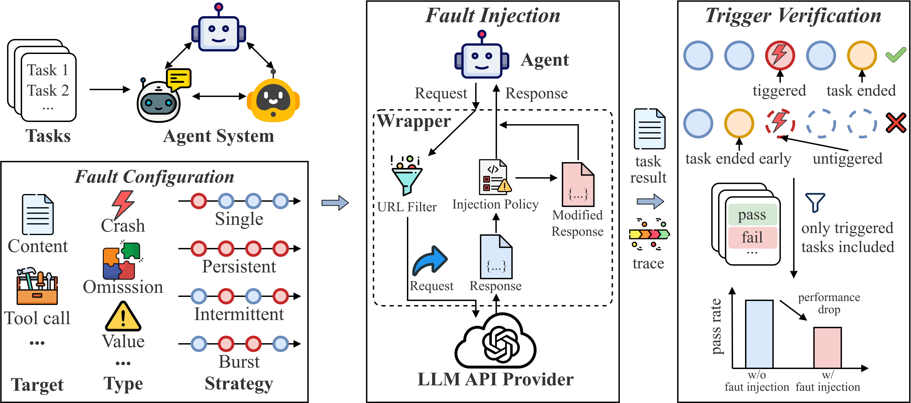
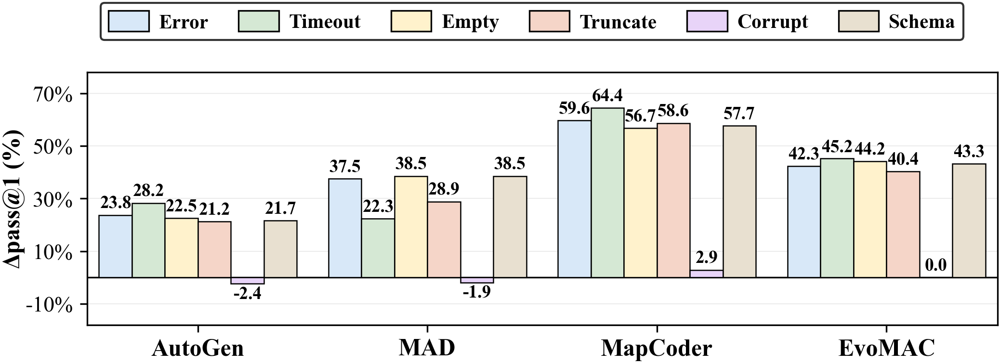
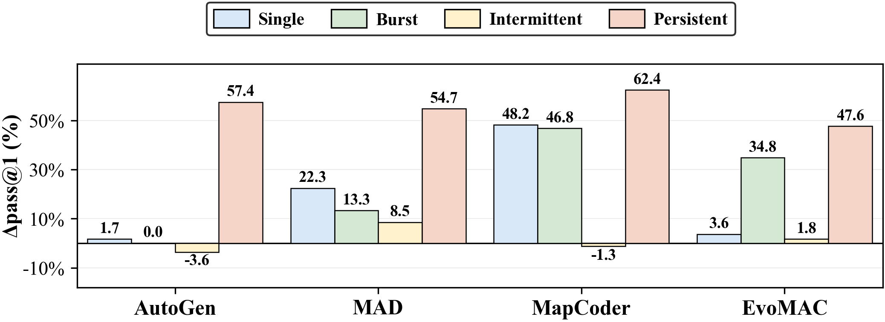

# AgentChaos
**Evaluate agent system robustness through controlled, runtime, non-intrusive LLM API fault injection.**

[](https://pypi.org/project/agentchaos-sdk/)
[](https://pypi.org/project/agentchaos-sdk/)
[](https://opensource.org/licenses/MIT)
[](https://github.com/floritange/AgentChaos/actions/workflows/ci.yml)
[](https://codecov.io/gh/floritange/AgentChaos?branch=main)
[]()
[](https://floritange.github.io/AgentChaos/)

---

## Overview

LLM-based agent systems issue multiple API calls per task, and each call can fail (HTTP 5xx, truncation, empty response, encoding corruption, schema violation). Once a faulty response occurs, it propagates through downstream agents and causes task failure. **AgentChaos** injects controlled faults at the HTTP transport layer — without modifying any agent source code — to evaluate robustness before these failures happen in production.

---

## Quick Start

```bash
pip install agentchaos-sdk
```

```python
import agentchaos

# Inject fault (your agent code needs ZERO changes)
agentchaos.inject("llm_error_single")
result = await my_agent(query)         # agent runs normally, unaware
agentchaos.disable()                   # stop
agentchaos.save_trace("trace.json")   # save full LLM call trace
```

```bash
# examples
git clone https://github.com/floritange/AgentChaos.git
cd AgentChaos
uv sync
uv run python examples/list_faults.py       # list all 65 faults
uv run python examples/agent_openai.py      # OpenAI agent: normal vs faulted
uv run python examples/agent_langchain.py   # LangChain agent
uv run python examples/agent_adk.py         # Google ADK agent
uv run python examples/eval_batch.py        # batch evaluation
```

---

## How It Works



An HTTP-layer injection mechanism patches the HTTP client at runtime to intercept and modify LLM API responses according to the fault configuration, requiring no changes to any agent system.

**Properties:**
- Works with **any** framework using OpenAI-compatible APIs (OpenAI, LangChain, ADK, AutoGen, CrewAI, LiteLLM)
- **Zero code changes** — just `inject()` / `disable()` around your existing code
- Records full **execution trace** (raw input/output, token usage, timing) for every LLM call
- **65 pre-built fault configurations** covering all real-world failure modes

---

## API

| Function | Description |
|---|---|
| `agentchaos.inject(fault)` | Start fault injection + trace (`None` = trace only) |
| `agentchaos.disable()` | Stop injection and trace |
| `agentchaos.save_trace(path)` | Save trace to JSON |
| `agentchaos.eval(agent_fn, query, faults)` | Batch robustness evaluation |
| `agentchaos.diagnose(text)` | Detect fault type from output |
| `agentchaos.list_faults()` | List all 65 experiments |

```python
import agentchaos

# Trace only (no fault)
agentchaos.inject(None)
result = await my_agent(query)
agentchaos.disable()
agentchaos.save_trace("trace_normal.json")

# Inject fault + trace
agentchaos.inject("llm_error_single")
result = await my_agent(query)
agentchaos.disable()
agentchaos.save_trace("trace_faulted.json")

# Batch evaluation
report = await agentchaos.eval(my_agent, query, faults="all")
print(report.summary())
```

---

## Trace Format

```json
{
  "call_index": 0,
  "raw_input": {"model": "gpt-5.5", "messages": [...], "tools": [...]},
  "raw_output": {
    "content": "The answer is 42.",
    "tool_calls": [],
    "finish_reason": "stop",
    "usage": {"prompt_tokens": 306, "completion_tokens": 54, "total_tokens": 360},
    "http_status": 200
  },
  "injected_output": {
    "content": "[API ERROR] HTTP 500: Internal Server Error.",
    "tool_calls": []
  },
  "timing": {"llm_latency_ms": 1523.4, "total_ms": 1524.1},
  "fault_applied": true
}
```

> `raw_output` = LLM original response. `injected_output` = what the agent actually receives (only present when `fault_applied: true`).

---

## Fault Taxonomy

We define a fault taxonomy by adapting the classical fault classification from distributed systems (Avizienis et al., 2004) to LLM API responses. The taxonomy covers crash, omission, and value faults on both content and tool call fields.

| Category | Fault Type | Content | Tool Call | Real-world Scenario |
|---|---|:---:|:---:|---|
| **Crash** | Error | yes | yes | Server overload, HTTP 5xx, rate limiting |
| **Crash** | Timeout | yes | yes | Network congestion, backend delay, API latency |
| **Omission** | Empty | yes | yes | Safety filter, content policy rejection |
| **Omission** | Truncate | yes | yes | Token limit, TCP interruption, incomplete completion |
| **Value** | Corrupt | yes | yes | Encoding error, garbled characters |
| **Value** | Schema | yes | yes | Parsing error, schema mismatch |

From **Crash** to **Value**, faults become progressively harder to detect. Crash faults produce obvious error signals and are typically retried. Value faults look like valid output and propagate silently — making them the most dangerous in practice.

**65 = (6 fault types x 2 targets x 4 strategies) + 8 compound + 9 positional**

Detailed documentation: **[docs/faults.md](docs/faults.md)**

---

## Evaluation Results

### Experimental Setup

<table>
<tr><th>Agent System</th><th>Architecture</th><th>Benchmarks</th></tr>
<tr><td><a href="https://openreview.net/forum?id=BAakY1hNKS">AutoGen</a></td><td>Iterative (coder + executor)</td><td rowspan="4"><a href="https://arxiv.org/abs/2107.03374">HumanEval</a>, <a href="https://openreview.net/forum?id=1qvx610Cu7">HumanEval+</a>, <a href="https://arxiv.org/abs/2108.07732">MBPP</a>, <a href="https://openreview.net/forum?id=1qvx610Cu7">MBPP+</a>, <a href="https://openreview.net/forum?id=US2eyuYlvS">MMLU-Pro</a>, <a href="https://aclanthology.org/2024.acl-long.410">MATH-500</a></td></tr>
<tr><td><a href="https://aclanthology.org/2024.acl-long.72">MAD</a></td><td>Debate (proposer + critic)</td></tr>
<tr><td><a href="https://aclanthology.org/2024.acl-long.269">MapCoder</a></td><td>Pipeline (planner + coder + debugger)</td></tr>
<tr><td><a href="https://openreview.net/forum?id=jd0RewGP4w">EvoMAC</a></td><td>Iterative (multi-agent collaboration)</td></tr>
<tr><td><a href="https://arxiv.org/abs/2510.22775">Mini-SE</a></td><td>Iterative (SWE agent)</td><td><a href="https://arxiv.org/abs/2501.14975">SWE-bench Pro</a></td></tr>
</table>

**Backbone LLMs**: Claude-Sonnet-4.5, GPT-5.2, DeepSeek-V3.2, Seed-1.8

**Metric**: Δpass@1 = pass@1 (w/o fault) − pass@1 (w/ fault). Higher = more vulnerable.

### RQ1: Overall Robustness Degradation (Claude-Sonnet-4.5)

| System | HumanEval | HumanEval+ | MBPP | MBPP+ | MMLU-Pro | MATH-500 |
|---|---|---|---|---|---|---|
| AutoGen | 19.44 | 21.13 | 17.31 | 11.61 | 7.05 | 8.38 |
| MAD | 24.20 | 24.84 | 24.49 | 15.08 | 20.64 | 20.70 |
| **MapCoder** | **48.61** | **49.30** | **41.07** | **40.85** | **38.25** | **34.27** |
| EvoMAC | 18.48 | 18.18 | 16.67 | 14.73 | 13.63 | 15.85 |
| Mini-SE | — | — | — | — | — | — |

> Mini-SE is evaluated only on SWE-bench Pro (Δpass@1 = 0.87%).

### RQ2: Impact of Fault Configurations





- Content faults cause higher Δpass@1 than tool call faults; only **corrupt** stays below 7%
- **Persistent** injection causes the highest Δpass@1 — up to **62.39%** (MapCoder)
- **Pipeline** systems are most position-sensitive — single early fault drops pass@1 by up to **83.87%**
- **Compound** content faults amplify degradation — up to **86.36%** (MapCoder)

### RQ3: Fault Diagnosis

Existing methods achieve below **53%** accuracy on fault type and below **56%** on fault step. Truncation — the most harmful fault — is identified with only **4.3%** accuracy.

### Key Findings

| # | Finding |
|---|---|
| 1 | All systems degrade under fault injection (Δpass@1 up to 50 pp) |
| 2 | Most severe faults are NOT most harmful — truncation/empty propagate silently |
| 3 | Most harmful faults are hardest to diagnose (truncation: 4.3% accuracy) |
| 4 | Architecture determines robustness — ranking consistent across all LLMs |
| 5 | Persistent injection overrides architectural advantages (up to 62.39%) |
| 6 | Compound content faults amplify degradation (up to 86.36%) |

---

## Documentation

- **[Fault Reference](docs/faults.md)** — Complete reference for all 65 fault configurations
- **[Examples](examples/)** — Runnable demos for OpenAI, LangChain, ADK

---

## Citation

If you use AgentChaos in your research, please cite:

```bibtex
@article{agentchaos2026,
  title={AgentChaos: Chaos Engineering for Robust Agent Evaluation via LLM API Fault Injection},
  year={2026}
}
```

---

## License

MIT -- see [LICENSE](LICENSE).
